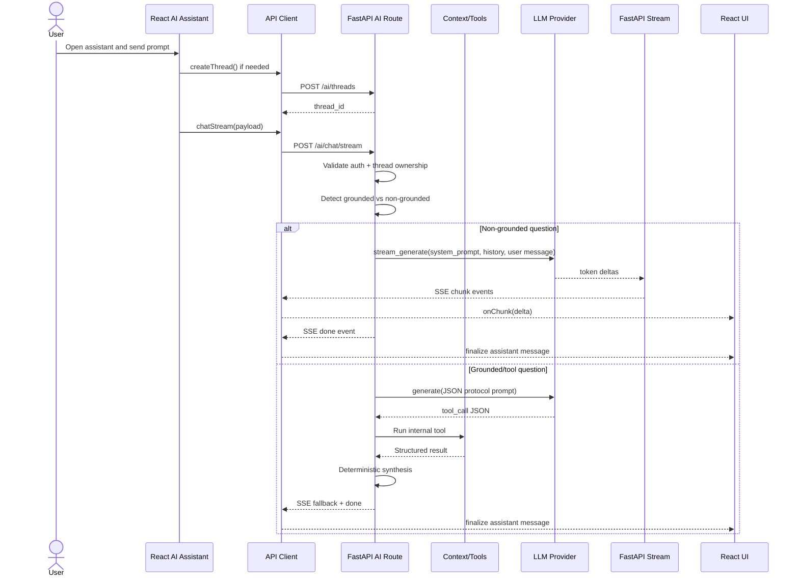
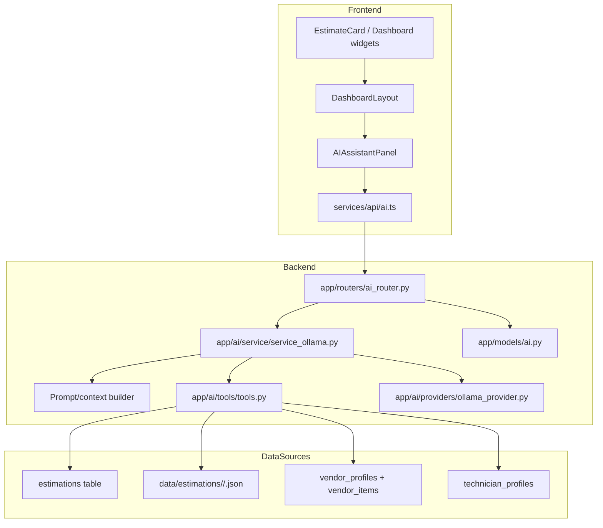
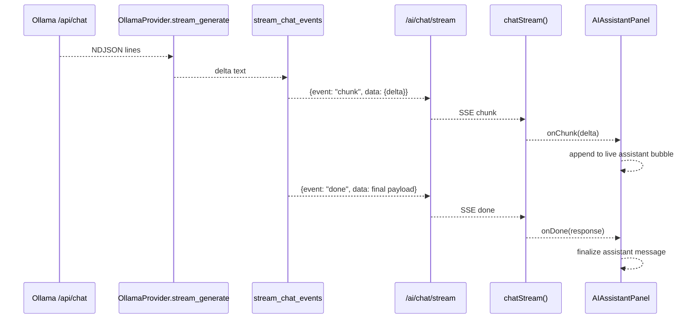

# AI Integration Module

This document audits the current AI integration in the ConstructHub codebase as implemented today. It covers the active backend and frontend behavior, the partial or placeholder pieces, the data flow, and the main risks you should understand before discussing this feature in an interview.

## Scope

- Backend AI package inspected: `backend/app/ai/`
- Active backend router inspected: `backend/app/routers/ai_router.py`
- Active AI persistence models inspected: `backend/app/models/ai.py`
- Estimation routes and storage inspected because the AI tools use them: `backend/app/routers/estimation.py`, `backend/app/estimation/storage.py`, `backend/app/models/estimate.py`
- Frontend AI client and UI inspected: `frontend/src/services/api/ai.ts`, `frontend/src/components/AIAssistantPanel.tsx`, `frontend/src/layouts/DashboardLayout.tsx`, `frontend/src/pages/BuilderDashboard.tsx`, `frontend/src/pages/Estimates.tsx`, `frontend/src/components/Estimates/EstimateCard.tsx`

## High-Level Summary

ConstructHub currently uses an Ollama-first AI integration. The active backend path is:

- `frontend/src/components/AIAssistantPanel.tsx`
- `frontend/src/services/api/ai.ts`
- `backend/app/routers/ai_router.py`
- `backend/app/ai/service/service_ollama.py`
- `backend/app/ai/providers/ollama_provider.py`

OpenAI-related files exist, but they are placeholders and are not active in the current runtime:

- `backend/app/ai/service/service_openai.py`
- `backend/app/ai/providers/openai_provider.py`

The implementation has two main response modes in practice:

1. General non-grounded chat:
   - Uses Ollama plain-text streaming.
   - Returns incremental text chunks over Server-Sent Events (SSE).
2. Grounded platform-data chat:
   - Uses one LLM call to decide whether to call an internal tool.
   - Then the backend runs a deterministic Python tool.
   - The final answer is synthesized by backend code, not by a second LLM call, for the currently supported tools.

This means the assistant is partly generative and partly deterministic depending on the question.

---

## 1. Backend AI Architecture

### Main backend AI files

| Path | Purpose | Status |
| --- | --- | --- |
| `backend/app/routers/ai_router.py` | FastAPI routes for threads, chat, streaming, prompts, history, feedback | Active |
| `backend/app/ai/service/service_ollama.py` | Main AI orchestration, tool selection loop, response synthesis, streaming logic | Active |
| `backend/app/ai/providers/ollama_provider.py` | HTTP client for Ollama `/api/chat` | Active |
| `backend/app/ai/config.py` | AI and Ollama env config parsing | Active |
| `backend/app/ai/tools/tools.py` | Internal deterministic tools used by AI | Active |
| `backend/app/ai/schemas/schemas.py` | Pydantic request/response models | Active |
| `backend/app/models/ai.py` | SQLAlchemy models for threads, messages, tool calls, feedback | Active |
| `backend/app/ai/prompts.py` | Static prompt templates exposed to frontend | Active |
| `backend/app/ai/service/service_openai.py` | Placeholder OpenAI service | Placeholder |
| `backend/app/ai/providers/openai_provider.py` | Placeholder OpenAI provider | Placeholder |

### Files requested but not found

The following files were not found in the current codebase:

- `backend/app/ai/routes.py`
- `backend/app/ai/ai_router.py`
- `backend/app/ai/dependencies.py`
- `backend/app/ai/context.py`
- `backend/app/ai/chat_history.py`
- `backend/app/ai/models.py`

Equivalent functionality exists in:

- Router: `backend/app/routers/ai_router.py`
- Models: `backend/app/models/ai.py`

### Main AI endpoints

All AI endpoints are mounted from `backend/app/routers/ai_router.py` under prefix `/ai`.

| Method | Route | Function | Auth required | Purpose |
| --- | --- | --- | --- | --- |
| `POST` | `/ai/threads` | `create_thread` | Yes | Create a chat thread tied to the current user and optional `project_id` |
| `POST` | `/ai/chat` | `chat` | Yes | Non-streaming chat response |
| `POST` | `/ai/chat/stream` | `chat_stream` | Yes | Streaming SSE chat endpoint |
| `GET` | `/ai/prompts` | `prompts` | No | Return static prompt templates, optionally filtered by role |
| `GET` | `/ai/threads/{thread_id}/messages` | `get_messages` | Yes | Return recent user/assistant history for a thread |
| `POST` | `/ai/feedback` | `feedback` | Yes | Save rating/comment for an assistant message |

### Provider support: Ollama vs OpenAI

#### What exists

- Ollama support exists and is active.
- OpenAI-related files exist only as placeholders.

#### What is actually used

The active router imports from `backend/app/ai/service/service_ollama.py`:

- `handle_chat`
- `stream_chat_events`

So the runtime path is hard-wired to the Ollama service file today.

#### Provider selection configuration

`backend/app/ai/config.py` defines:

- `AI_PROVIDER`
- `AI_MAX_TOOL_CALLS`
- `AI_MAX_HISTORY_MESSAGES`
- `AI_MAX_GROUNDED_HISTORY_MESSAGES`
- `AI_GROUNDED_NUM_PREDICT`
- `AI_STREAM_NUM_PREDICT`

`backend/app/ai/service/service_ollama.py` has `_provider_factory(provider_name=None)`, but it currently only returns `OllamaProvider()`.

If `AI_PROVIDER` is set to a non-Ollama value, the code logs a warning and still falls back to Ollama:

- `"Unsupported AI_PROVIDER '%s' in current runtime; falling back to Ollama provider."`

#### Practical conclusion

The codebase contains provider selection configuration, but only Ollama is functional today. OpenAI is not a working runtime option yet.

### Environment variables found

From `backend/.env` and `backend/app/ai/config.py`, the AI-related env vars found are:

| Variable | Found in code/env | Purpose |
| --- | --- | --- |
| `AI_PROVIDER` | Yes | Intended provider selector, but current runtime still falls back to Ollama |
| `OLLAMA_BASE_URL` | Yes | Ollama HTTP server base URL |
| `OLLAMA_MODEL` | Yes | Ollama model name |
| `AI_MAX_TOOL_CALLS` | Yes | Max tool calls allowed in grounded loop |
| `AI_MAX_HISTORY_MESSAGES` | Yes | Normal history window |
| `AI_MAX_GROUNDED_HISTORY_MESSAGES` | Yes | Grounded-history window |
| `AI_GROUNDED_NUM_PREDICT` | Yes | Token cap for grounded/tool protocol turns |
| `AI_STREAM_NUM_PREDICT` | Yes | Token cap for stream-text turns |
| `AI_TEMPERATURE` | Yes | Ollama generation temperature |
| `OLLAMA_TIMEOUT` | Yes | Ollama request timeout |
| `OLLAMA_NUM_PREDICT` | Yes in config/README, not set in `.env` | Default provider token cap |

No active OpenAI env vars were found.

### How the backend receives a user message

The backend receives chat messages through `ChatRequest` in `backend/app/ai/schemas/schemas.py`:

```python
class ChatRequest(BaseModel):
    thread_id: str
    message: str
    context: Optional[ChatContext] = None
    response_mode: Literal["text", "structured"] = "structured"
    client_trace_id: Optional[str] = None
    prompt_id: Optional[str] = None
```

`ChatContext` supports:

- `project_id`
- `location`
- `role`
- `budget_kes`

### Request validation

Validation is handled by FastAPI + Pydantic:

- Request body shape is validated by `ChatRequest`, `ThreadCreateRequest`, and `FeedbackRequest`.
- Invalid thread ownership is checked manually in route/service logic.
- Feedback target validation is handled by `_validate_feedback_target`.

Additional runtime validation happens in `service_ollama.py`:

- thread existence and ownership
- missing tool arguments
- placeholder `project_id` replacement
- allowed tool name checks
- max tool call limit
- malformed model JSON repair retry

### Response schemas

#### Thread create

```python
class ThreadResponse(BaseModel):
    thread_id: str
    title: str
    project_id: Optional[str] = None
    created_at: str
```

#### Chat response

```python
class ChatResponse(BaseModel):
    thread_id: str
    message_id: str
    assistant: AssistantPayload
    usage: Usage = Field(default_factory=Usage)
```

#### Assistant payload

```python
class AssistantPayload(BaseModel):
    text: str
    confidence: float = 0.0
    citations: list[Citation] = Field(default_factory=list)
    cards: list[Card] = Field(default_factory=list)
    next_actions: list[NextAction] = Field(default_factory=list)
```

#### Thread history response

```python
class ThreadMessagesResponse(BaseModel):
    thread_id: str
    messages: list[MessageOut]
```

Important detail: `MessageOut` includes `cards`, but does not include `citations` or `next_actions`. That affects history restoration on the frontend.

### Streaming support

#### Is streaming supported?

Yes, but only partially.

#### Route

- `POST /ai/chat/stream`

#### Transport

- FastAPI `StreamingResponse`
- `media_type="text/event-stream"`
- Custom SSE event serialization in `_serialize_sse_event`

#### Event types emitted by backend

From `chat_stream` and `stream_chat_events`:

- `status`
- `chunk`
- `fallback`
- `done`
- `error`
- `end`

#### How streaming works technically

There are two streaming behaviors:

1. Non-grounded questions:
   - `stream_chat_events()` saves the user message.
   - Calls `OllamaProvider.stream_generate()`.
   - Streams plain text deltas as `chunk` events.
   - Concatenates deltas, persists final assistant message, then emits `done`.

2. Grounded/platform-data questions:
   - `stream_chat_events()` does not live-stream tokens from a tool workflow.
   - It emits a `status` event, then calls the existing non-stream `handle_chat()`.
   - After `handle_chat()` finishes, it emits `fallback` and `done`.
   - So this route is still SSE, but not token-streaming for tool-backed answers.

#### Important conclusion

Streaming is hybrid:

- true token streaming for general text answers
- SSE-wrapped non-stream fallback for estimate/vendor/technician/tool-backed answers

### How the model response is generated

#### General non-grounded path

`stream_chat_events()` uses:

- `STREAM_TEXT_SYSTEM_PROMPT`
- conversation history
- current user message

Then `OllamaProvider.stream_generate()` calls Ollama `/api/chat` with:

- `stream: true`
- `model`
- `messages`
- `options.temperature`
- `options.num_predict`

#### Grounded/tool path

`handle_chat()` uses:

- `SYSTEM_PROMPT`
- recent history
- current user message with optional prompt template and context

The system prompt forces the model to return strict JSON of either:

1. `{"type":"tool_call", ...}`
2. `{"type":"final", ...}`

If the model returns a tool call:

- backend validates tool name and args
- backend executes the internal Python tool
- backend logs the tool call in `ai_tool_calls`
- for currently supported tools, backend synthesizes the final answer deterministically using Python functions:
  - `_synthesize_estimate_summary`
  - `_synthesize_material_listings`
  - `_synthesize_technicians`
  - `_synthesize_rough_cost`

### System prompts and prompt construction

#### Prompt template source

Static prompt templates live in `backend/app/ai/prompts.py`.

Functions:

- `list_prompts(role=None)`
- `get_prompt(prompt_id)`

#### Main system prompts

Defined in `backend/app/ai/service/service_ollama.py`:

- `SYSTEM_PROMPT`
- `STREAM_TEXT_SYSTEM_PROMPT`

#### How user content is built

`_build_user_content(payload)`:

1. If `prompt_id` is present, it loads the prompt template and appends it.
2. Appends `payload.message`.
3. If `context` exists, appends `Context: {...}`.

This means the effective user content may contain:

- a static prompt template
- the typed user message
- serialized context dict

### Conversation history storage and retrieval

#### Persistence

Chat persistence is implemented in `backend/app/models/ai.py`:

- `AIThread`
- `AIMessage`
- `AIToolCall`
- `AIFeedback`

#### What is stored

- Thread metadata: user, optional project, title
- User messages
- Assistant messages
- Tool protocol messages with `role="tool"` and raw/parsed JSON
- Tool call logs with args/result/status/latency
- Feedback ratings/comments

#### Retrieval

`GET /ai/threads/{thread_id}/messages`:

- verifies ownership
- loads the latest message window
- returns only `user` and `assistant` messages
- filters out `tool` and `system`

#### History windowing

`service_ollama.py` uses:

- `AI_MAX_HISTORY_MESSAGES`
- `AI_MAX_GROUNDED_HISTORY_MESSAGES`

Grounded turns intentionally use a smaller history window.

### Authentication requirements

All main AI data routes require `get_current_user` except:

- `GET /ai/prompts`

`get_current_user` is implemented in `backend/app/auth/dependencies.py` using:

- OAuth2 bearer token
- JWT decode via `decode_access_token`
- DB lookup of the user

### Estimate/project context injection

Estimate context is not sent as a full blob from the frontend. Instead, the current implementation passes lightweight context:

- `context.project_id`
- `context.location`
- optional thread-level `project_id`

Then the backend loads the full estimate blob only if a tool call needs it:

- `get_estimate_summary(project_id, db, user_id)`

Project context resolution order for estimate lookup:

1. `payload.context.project_id`
2. `thread.project_id`

If the model emits a placeholder `project_id` like `"your_project_id"`, the backend replaces it with the thread or request context project id when possible.

### Error handling

#### Non-stream route

`POST /ai/chat`:

- `ValueError` becomes HTTP `404`
- any other exception rolls back DB and returns HTTP `500` with `"AI chat failed"`

#### Stream route

`POST /ai/chat/stream`:

- thread not found returns HTTP `404` before stream starts
- runtime failures become streamed `error` events
- route always emits an `end` event in `finally`

#### Provider/network failures

`OllamaProvider` uses `httpx.AsyncClient` and `raise_for_status()`.

Provider errors bubble up to:

- route-level `500` on `/ai/chat`
- streamed `error` event and fallback assistant persistence on `/ai/chat/stream`

### Timeouts and unavailable model server handling

Ollama timeout is configured via `OLLAMA_TIMEOUT` in `OllamaConfig`.

When Ollama is unavailable or errors:

- non-stream route fails the request
- stream route emits an error event and persists `"The live stream was interrupted. Please try again."`

There is no secondary provider fallback implemented.

### Deterministic vs LLM-generated behavior

| Part | Deterministic or LLM-generated | Notes |
| --- | --- | --- |
| Thread creation | Deterministic | Pure backend DB write |
| History retrieval | Deterministic | Pure DB read |
| Prompt templates | Deterministic | Static list in `prompts.py` |
| Grounded tool selection | LLM-generated | Model chooses tool JSON |
| Tool execution | Deterministic | Python functions + DB/file lookups |
| Grounded final tool-backed answer | Deterministic in current supported tools | Synthesized by backend Python, not a second LLM call |
| General construction Q&A | LLM-generated | Streamed plain text from Ollama |
| Rough cost band | Deterministic | Heuristic formula in Python |

---

## 2. Frontend AI Architecture

### Main frontend AI-related files

| Path | Purpose | Status |
| --- | --- | --- |
| `frontend/src/components/AIAssistantPanel.tsx` | Main AI chat UI | Active |
| `frontend/src/services/api/ai.ts` | AI API client and SSE parser | Active |
| `frontend/src/services/api/client.ts` | Shared fetch client and token handling | Active |
| `frontend/src/layouts/DashboardLayout.tsx` | Mounts the AI panel and injects pending estimate-summary actions | Active |
| `frontend/src/pages/BuilderDashboard.tsx` | Opens panel and passes estimate-summary actions from dashboard cards | Active |
| `frontend/src/pages/Estimates.tsx` | Same estimate-summary entry point from estimates page | Active |
| `frontend/src/components/Estimates/EstimateCard.tsx` | "Ask AI for Summary" button | Active |
| `frontend/src/pages/EstimateDetail.tsx` | Loads estimate details page | Active, but not AI-wired |
| `frontend/src/pages/AIChat.tsx` | Placeholder `/ai` page | Placeholder |

### Files requested but not found

The following frontend locations were not found:

- `frontend/src/features/ai/`
- `frontend/src/hooks/ai/`

No Zustand store or TanStack Query AI module was found.

### Main UI component

The main assistant UI is `frontend/src/components/AIAssistantPanel.tsx`.

It is a right-side panel with:

- greeting message
- prompt-template buttons
- scrollable message list
- loading/typing indicator
- text input
- send button
- simple error text area

### How the chat panel is opened

The panel is mounted in `frontend/src/layouts/DashboardLayout.tsx`.

It opens from:

- floating AI button in the dashboard layout
- `WelcomeSection` "Ask AI Assistant" button
- `AIAssistantWidget` "Ask AI Assistant" button
- `EstimateCard` "Ask AI for Summary" button

### How estimate context is passed from the UI

#### Implemented path

Estimate context is passed from:

- `frontend/src/components/Estimates/EstimateCard.tsx`
- `frontend/src/components/BuilderDashboard/RecentEstimations.tsx`
- `frontend/src/pages/BuilderDashboard.tsx`
- `frontend/src/pages/Estimates.tsx`
- `frontend/src/layouts/DashboardLayout.tsx`

`DashboardLayout.handleAskEstimateSummary()` builds a `pendingAiAction` containing:

- `message`
- `statusText`
- `context.project_id`
- `context.location`
- `threadProjectId`
- `threadTitle`

That action is consumed by `AIAssistantPanel` in a `useEffect`, which immediately sends the message.

#### Not currently implemented

`frontend/src/pages/EstimateDetail.tsx` loads estimate details but does not currently open the AI panel or inject that page's estimate into the assistant.

### How user prompts are submitted

`AIAssistantPanel.sendMessage()`:

1. Appends the user's text locally.
2. Shows an AI loading bubble.
3. Creates a thread first if `threadId` does not exist.
4. Sends the message to `/ai/chat/stream`.
5. Falls back to `/ai/chat` if streaming fails.

### Frontend transport and API client behavior

#### Non-streaming calls

Uses shared `apiFetch()` from `frontend/src/services/api/client.ts` for:

- `createThread`
- `chat`
- `getThreadMessages`
- `getPrompts`

#### Streaming calls

Uses raw `fetch()` in `chatStream()` from `frontend/src/services/api/ai.ts`.

It does not use:

- `EventSource`
- Axios

It manually parses the SSE response body with:

- `ReadableStreamDefaultReader`
- `TextDecoder`
- a line buffer
- `event:` / `data:` parsing

### How streaming text is rendered

`AIAssistantPanel` uses:

- `ensureLoadingMessage()`
- `setLoadingStatus()`
- `pushStreamDelta()`
- `finalizeAssistantMessage()`

Behavior:

- initial AI bubble shows typing indicator
- `chunk` events append text into the last AI bubble
- `done` replaces the temporary bubble with the final assistant payload

### Loading, disabled input, errors, retry behavior

#### Loading state

- `sending` disables the input and send button
- a typing indicator is shown with optional status text

#### Retry behavior

If `chatStream()` throws, `sendMessage()` retries via `chat()`:

1. update status to `"Retrying without live stream..."`
2. call `POST /ai/chat`
3. render the returned final assistant payload

#### Error display

- frontend sets `error` state
- final assistant bubble may display the error message text
- a small red error text block is also rendered below the input

There is no separate retry button.

### Chat history display

History is fetched from:

- `GET /ai/threads/{thread_id}/messages?limit=50`

It is loaded when the panel has a `threadId`, except immediately after creating a new thread, where hydration is temporarily suppressed to avoid overwriting optimistic local state.

#### Message ordering

Messages are displayed oldest-to-newest, with newest at the bottom.

Evidence:

- backend `get_messages()` reverses descending DB results
- frontend scrolls to `chatEndRef`
- frontend appends new messages to the end of the array

### Frontend formatting behavior

Assistant text is post-processed in the UI:

- `sanitizeAssistantText()` removes lines beginning with `Estimate ID:`
- it also hides UUID-like strings by replacing them with `[hidden-id]`
- `renderStructuredText()` renders headings, bullet lists, ordered lists, and inline bold markers

### Frontend fallback/mock behavior related to AI

No dedicated AI mock module was found.

Related non-AI estimate pages can run in mock mode through `VITE_USE_MOCKS`, for example:

- `frontend/src/hooks/Estimator/useEstimations.ts`
- `frontend/src/hooks/Estimator/useEstimationDataById.tsx`

That means estimate pages can be mocked, while the AI panel itself still expects live backend AI endpoints.

### Frontend/backend mismatches and inconsistencies

#### 1. Prompt button duplication

When a preset prompt button is clicked, the frontend sends:

- `message = p.template`
- `prompt_id = p.id`

Then backend `_build_user_content()` appends:

1. the prompt template from `prompt_id`
2. the same `payload.message`

So prompt-template text is duplicated in the final prompt sent to the model.

#### 2. `response_mode` is not meaningfully used

Frontend always sends `response_mode: "structured"`.

Backend accepts it in schema but does not use it to select behavior. The route chosen and grounded detection determine the actual mode.

#### 3. `client_trace_id` exists in schema but is unused

It is defined in both frontend and backend types but no active runtime logic uses it.

#### 4. History endpoint drops citations and next actions

Fresh assistant responses may include:

- `citations`
- `cards`
- `next_actions`

But `GET /ai/threads/{thread_id}/messages` only returns:

- `id`
- `role`
- `text`
- `created_at`
- `cards`

So after reload, citations and next actions are not restored in the UI.

#### 5. Stream auth path bypasses shared unauthorized handling

`chatStream()` uses raw `fetch()`, not `apiFetch()`.

So the shared `401` handling in `frontend/src/services/api/client.ts`:

- clear token
- redirect to `/login`

does not automatically apply to the streaming route.

#### 6. `/ai` page is placeholder

The route `frontend/src/pages/AIChat.tsx` only renders:

- `"ai chat route"`

The real assistant experience is the side panel in `DashboardLayout`.

---

## 3. End-to-End AI Request Lifecycle

There are two important end-to-end flows in the current implementation: a general question flow and an estimate-summary flow.

### A. General question flow

1. The user opens a dashboard page rendered inside `frontend/src/layouts/DashboardLayout.tsx`.
2. The user opens the AI panel using the floating button, `WelcomeSection`, or `AIAssistantWidget`.
3. `frontend/src/components/AIAssistantPanel.tsx` renders the panel and loads prompt templates from `GET /ai/prompts`.
4. The user types a question and clicks send.
5. `sendMessage()` appends the user message locally and shows a loading bubble.
6. If no thread exists yet, `createThread()` sends `POST /ai/threads`.
7. The frontend sends `POST /ai/chat/stream` using `chatStream()` with:
   - `thread_id`
   - `message`
   - optional `context`
   - `response_mode: "structured"`
   - optional `prompt_id`
8. `backend/app/routers/ai_router.py` receives the request as `ChatRequest`.
9. `chat_stream()` verifies the thread belongs to the current authenticated user.
10. `stream_chat_events()` decides whether the message requires a grounded tool path using `_requires_grounded_tool()`.
11. For a general question, the answer is treated as non-grounded.
12. The backend saves the user message in `ai_messages`.
13. The backend loads recent thread history using `_load_recent_messages()`.
14. The backend builds prompt content using `_build_user_content()`.
15. `OllamaProvider.stream_generate()` sends a streaming request to Ollama `/api/chat`.
16. Ollama returns NDJSON lines with partial assistant deltas.
17. The backend emits SSE `chunk` events to the frontend.
18. The frontend appends each delta to the live assistant bubble.
19. When streaming ends, the backend joins the deltas into final text, persists the assistant message, and emits `done`.
20. The frontend finalizes the last assistant message bubble with the final payload.

### B. Estimate-summary flow from dashboard/estimates cards

1. The user clicks "Ask AI for Summary" on an estimate card.
2. `frontend/src/components/Estimates/EstimateCard.tsx` calls `onAskAiSummary`.
3. `DashboardLayout.handleAskEstimateSummary()` creates a `pendingAiAction` with:
   - a summary-focused message
   - `context.project_id = estimate.id`
   - `context.location = estimate.location`
   - `threadProjectId = estimate.id`
   - `threadTitle = "AI for <project name>"`
4. The dashboard layout opens the AI side panel.
5. `AIAssistantPanel` consumes `pendingAiAction` in a `useEffect` and calls `sendMessage()`.
6. If no thread exists, the panel creates one with `project_id` already attached to the thread.
7. The frontend sends `POST /ai/chat/stream`.
8. Backend `stream_chat_events()` detects this as a grounded request because `context.project_id` is present.
9. Instead of live-token streaming, the backend emits a `status` event and calls `handle_chat()`.
10. `handle_chat()` saves the user message and loads recent history.
11. The backend builds the user content, including the optional context dict.
12. The backend calls Ollama once with `SYSTEM_PROMPT`, asking for strict JSON.
13. The model returns either a `tool_call` JSON or a `final` JSON.
14. For estimate summary requests, the expected tool is `get_estimate_summary`.
15. `_run_tool()` calls `get_estimate_summary(project_id, db, user_id)`.
16. `get_estimate_summary()` loads the estimate record and then the estimation JSON blob from `data/estimations/{user_id}/{estimate_id}.json`.
17. The tool returns:
   - `summary`
   - `project_details`
   - `breakdown`
   - `phase_insights`
   - `permits`
   - `recommendations`
   - `source`
18. `_synthesize_estimate_summary()` converts that tool result into a deterministic `AssistantPayload`.
19. The backend persists the assistant message and emits SSE `fallback` then `done`.
20. The frontend finalizes the loading bubble with the returned assistant text, cards, citations, and next actions.

### C. Reload/history flow

1. If the panel already has a `threadId`, `AIAssistantPanel` loads history from `GET /ai/threads/{thread_id}/messages`.
2. Backend verifies ownership and returns recent `user` and `assistant` messages.
3. Frontend restores those messages into local state.
4. Only `cards` are restored from persisted structured content; `citations` and `next_actions` are not currently included in that history endpoint.

---

## 4. AI Tools and Context Injection

### Internal tools available to the assistant

Defined in `backend/app/ai/tools/tools.py` and allowed in `service_ollama.py`:

| Tool name | Active | Purpose |
| --- | --- | --- |
| `get_estimate_summary` | Yes | Load saved estimation blob and derive summary + phase insights |
| `get_project_summary` | Partial alias | Internally treated as alias for `get_estimate_summary`, but not listed in the system prompt's allowed tool names |
| `search_material_listings` | Yes | Search vendor items by material, location, and optional max price |
| `search_technicians` | Yes | Search technician profiles by profession and location |
| `rough_cost_estimate` | Yes | Return heuristic residential cost band |

### How tools are used

Tools are not exposed through native provider function-calling APIs.

Instead:

1. The model is instructed via prompt to emit JSON describing a tool call.
2. The backend manually parses that JSON.
3. The backend executes the tool in Python.
4. The backend logs the tool call in `ai_tool_calls`.
5. The backend usually synthesizes the final answer itself.

### Tool details

#### `get_estimate_summary`

Location:

- `backend/app/ai/tools/tools.py`

Inputs:

- `project_id`
- `db`
- `user_id`

Behavior:

- coerces `user_id` to int
- looks up `Estimation` by `estimate_id` and `user_id`
- loads the file blob via `load_estimation_blob()`
- computes `phase_insights` from the breakdown

Returns:

- `estimate_id`
- `summary`
- `project_details`
- `breakdown`
- `phase_insights`
- `permits`
- `recommendations`
- `source`

#### `search_material_listings`

Queries:

- `VendorItem`
- `VendorProfile`

Filters:

- material name/description substring
- availability
- optional location
- optional max price

Returns selected listing data, not full vendor records.

#### `search_technicians`

Queries:

- `TechnicianProfile`

Filters:

- specialization/skills substring
- optional location
- optional verified-only flag

Returns selected technician fields including contact phone/email in the tool result.

#### `rough_cost_estimate`

Pure deterministic heuristic. No DB lookup required.

Features:

- quality-based per-sqm rate
- Nairobi/Kiambu multiplier
- Mombasa multiplier
- room-based area estimate if floor area is not provided

### Estimate summaries and cost drivers

There is a real helper like `get_estimate_summary`.

Cost-driver analysis is derived by:

- `_build_phase_insights()`
- `_extract_top_costs()`

These compute:

- top material costs per phase
- top labour costs per phase
- share of phase total vs total project cost
- simple notes such as labour-heavy or material-heavy phases

### How project/estimate context is passed

Context injection is minimal on the frontend and richer on the backend.

Frontend passes:

- `project_id`
- `location`

Backend expands that by loading the real estimation blob when needed.

### Are raw database records exposed to the model?

Partially.

- `search_material_listings` and `search_technicians` gather selected fields from DB models.
- `get_estimate_summary` gathers structured estimate blob data from disk plus some DB metadata.

However, for the currently supported grounded tools, the final user-facing answer is synthesized by Python, so the final answer does not require a second LLM to interpret raw tool results.

### Privacy and security considerations

What is protected:

- AI threads are owned by users and checked by `user_id`
- estimate summaries are loaded using the current authenticated user id
- thread message history is ownership-checked

What to watch:

- `search_technicians()` includes contact `phone` and `email` in the tool result payload
- `/ai/prompts` is public
- CORS is `allow_origins=["*"]` in `backend/app/main.py`

---

## 5. Prompt Engineering

### Where prompts are defined

| Path | Purpose |
| --- | --- |
| `backend/app/ai/service/service_ollama.py` | Main system prompts |
| `backend/app/ai/prompts.py` | Static frontend prompt templates |

### Prompt types in the codebase

#### 1. Tool-protocol system prompt

`SYSTEM_PROMPT`:

- identifies the assistant as `"ConstructHub AI Construction Assistant for builders in Kenya"`
- forces strict JSON output
- defines allowed tool-call JSON shape
- defines final response JSON shape
- instructs tool usage for platform facts

#### 2. Streaming plain-text system prompt

`STREAM_TEXT_SYSTEM_PROMPT`:

- identifies the assistant as `"ConstructHub AI Construction Assistant"`
- requests concise practical guidance for builders in Kenya
- tells the model to ask for grounded lookup when platform facts are needed

#### 3. Static frontend prompt templates

`backend/app/ai/prompts.py` defines prompt templates such as:

- `builder-summary`
- `builder-rough-cost`
- `builder-permits`
- `vendor-material-search`
- `technician-find-work`
- `general-permits`

### Is there a system prompt?

Yes. Two system prompts exist:

- one for JSON/tool protocol turns
- one for plain-text streaming turns

### Is the prompt role-specific?

Partially.

- Prompt templates are role-filtered by `role`
- The main system prompts are not meaningfully role-specialized beyond the general builder/construction framing

### Is the prompt construction-domain-specific?

Yes.

It explicitly frames the assistant around:

- construction
- builders
- permits
- estimates
- materials
- technicians

### Is the prompt Kenya-market-aware?

Yes, in several places:

- both system prompts mention Kenya
- prompt templates mention Kenya
- `rough_cost_estimate()` includes location multipliers for Nairobi/Kiambu and Mombasa

### Does the prompt tell the model to avoid legal/engineering overclaiming?

Not found in current codebase.

There is no explicit system instruction telling the model to:

- avoid legal advice
- avoid structural-engineering authority claims
- cite uncertainty on code/compliance questions

### Do prompts include project/estimate context?

Yes, when supplied.

`_build_user_content()` appends:

- prompt template text if `prompt_id` exists
- raw user message
- `Context: {...}` with serialized `ChatContext`

### Do prompts include formatting instructions?

Yes.

The JSON/tool prompt is highly structured.

The plain-text streaming prompt asks for:

- plain text
- concise
- practical guidance

### Weaknesses in the current prompt strategy

1. Tool-calling is prompt-enforced JSON, not native function calling.
2. Prompt-button usage duplicates the same template text in the final prompt.
3. No explicit safety wording for legal/engineering/compliance advice.
4. No citation requirement for general LLM answers.
5. No role-specialized system prompts for builder vs vendor vs technician flows.
6. The prompt knows about platform tools but not about a broader verified knowledge base.
7. Grounded classification is keyword-based in `_requires_grounded_tool()`, so edge cases may route incorrectly.

### Suggested prompt improvements

1. Add an explicit uncertainty/scope section for legal, permitting, structural, and code-compliance advice.
2. Remove duplicate preset-template content by changing either frontend or `_build_user_content()`.
3. Add role-specific system prompt variants keyed by authenticated user role.
4. Require citation style even for internal-tool answers.
5. Add clearer instructions for budget reasoning and assumption disclosure.
6. If migrating providers, use native tool/function calling instead of strict-JSON prompting.

---

## 6. What the AI Assistant Can Currently Do

The current implementation supports the following features that are actually present in the code:

1. General construction Q&A in plain text for non-grounded questions.
2. Summarizing a saved estimate when the assistant has a valid `project_id`.
3. Highlighting top cost-driving phases from a saved estimate.
4. Showing high-level planning observations from estimate breakdown data.
5. Showing rough materials/labour/other cost mix from saved estimate summary data.
6. Searching material listings from vendor inventory by material name and optional location/max price.
7. Searching technician profiles by profession and optional location.
8. Returning a rough residential cost band using heuristic logic when no saved estimate is available.
9. Persisting chat threads and messages per authenticated user.
10. Persisting AI feedback ratings/comments for assistant messages.
11. Returning role-filtered prompt-template buttons to the frontend.
12. Streaming token-by-token text for non-grounded questions.

Capabilities not confirmed should not be claimed as implemented. For example:

- vendor recommendation ranking beyond simple price/rating query logic: not found as a distinct AI feature
- citations to external sources: not found
- true RAG over construction documents: not found
- persistent multi-session semantic memory: not found

---

## 7. Current Limitations and Risks

1. OpenAI support is not actually implemented, even though placeholder files and `AI_PROVIDER` exist.
2. The active provider is effectively Ollama-only, so local model/server availability is a runtime dependency.
3. General construction answers are ungrounded LLM output and can hallucinate.
4. There is no RAG pipeline or verified knowledge base for general domain answers.
5. There are no source citations for general non-grounded answers.
6. Tool-calling is implemented through prompt-enforced JSON, which is less reliable than native function calling.
7. `response_mode` exists in the schema but is not meaningfully used to drive backend behavior.
8. `client_trace_id` exists in the schema but is currently unused.
9. Estimate-detail page AI integration is missing; the page loads estimate data but does not pass it into the assistant.
10. `/ai` frontend page is only a placeholder and is not the real chat experience.
11. History restoration does not include `citations` or `next_actions`, only `cards`.
12. The prompt-template button flow duplicates prompt text in the constructed model input.
13. Grounded/tool answers are not truly token-streamed; they are SSE-wrapped completed responses.
14. There is no frontend feedback UI for `/ai/feedback`, even though the backend endpoint exists.
15. There is no chat-history search, summarization, archival UI, or admin AI management UI.
16. There is no evaluation framework or answer-quality benchmark suite.
17. There is no production-grade monitoring, tracing, or cost analytics for AI requests.
18. There is no provider failover strategy if Ollama is down.
19. `search_technicians()` includes contact info in tool results, which needs deliberate privacy handling if future synthesis changes expose more fields.
20. `backend/requirements.txt` does not list `httpx`, even though `backend/app/ai/providers/ollama_provider.py` imports it.
21. `AIThread.user_id` is modeled as `String` while `users.id` is `Integer`, which is a schema/type-consistency risk.
22. In a non-grounded streaming failure path, the frontend fallback to `/ai/chat` can potentially create duplicate user messages for the same turn because the stream route already persisted the user message before failing.
23. There is no explicit safety prompt for legal/compliance/engineering overclaim prevention.
24. CORS is open to all origins in `backend/app/main.py`, which is not production-hardened.

---

## 8. How to Explain This AI Integration in an Interview

This section is written in first person so you can reuse it directly.

### 30-second explanation

I built the AI assistant as a full-stack feature with React on the frontend and FastAPI on the backend. The frontend opens a side-panel chat UI, sends messages to a FastAPI AI router, and uses SSE streaming for live responses. On the backend, simple general questions go straight to a local Ollama model, but estimate-specific and marketplace-specific questions first go through deterministic internal tools so the assistant can answer using real ConstructHub data instead of guessing.

### 2-minute technical explanation

In this project, the frontend AI experience lives in a reusable `AIAssistantPanel` component. It creates a thread, sends chat requests, renders streamed output, and restores prior messages from the backend. The backend exposes `/ai/threads`, `/ai/chat`, `/ai/chat/stream`, and `/ai/threads/{thread_id}/messages`.

The most important architectural decision is that not all AI answers are handled the same way. If the question is general, like a construction concept question, the backend streams a plain-text response from Ollama. If the question is about platform data, like summarizing an estimate or finding technicians, the backend uses a tool-selection loop. The model is prompted to return strict JSON indicating either a tool call or a final answer. Then Python code runs internal tools such as `get_estimate_summary`, `search_material_listings`, `search_technicians`, or `rough_cost_estimate`.

For the currently supported grounded tools, the final answer is actually synthesized by backend Python code, not by another LLM call. That keeps estimate summaries and listing results more controlled and easier to debug. So the system is hybrid: generative for open-ended questions, deterministic for platform-data responses.

### Deep technical explanation for follow-up questions

The request starts in the React panel component. If there is no thread yet, the frontend first creates one with `POST /ai/threads`, optionally attaching a `project_id`. Then it sends the turn to `POST /ai/chat/stream` using a custom fetch-based SSE parser because it needs a `POST` body and bearer auth, which is harder with `EventSource`.

On the backend, the stream route checks whether the question needs grounded data. That decision is made by `_requires_grounded_tool()` using explicit `context.project_id`, thread project context, and platform-related keywords. For non-grounded questions, the backend calls `OllamaProvider.stream_generate()` and relays token deltas as SSE `chunk` events. For grounded questions, the stream route falls back to the non-stream `handle_chat()` flow but still wraps the final result in SSE events so the frontend can keep one chat entry point.

Inside `handle_chat()`, the backend persists the user message, loads recent history, builds the effective prompt, and calls the LLM with a strict JSON protocol. The backend then validates the tool call, fills missing `project_id` from thread context if possible, executes the Python tool, logs the tool result, and synthesizes the assistant payload. That payload includes text, confidence, citations, cards, and next actions, and is stored in `ai_messages`.

### Why I used FastAPI

I used FastAPI because it gives me strong request validation with Pydantic, clean async route handling, and straightforward streaming responses. That matters for AI features because I need typed request/response contracts, auth integration, and an efficient async path for model calls and SSE streaming.

### Why I used React

I used React because the AI assistant is stateful and interactive. I needed a component that could manage optimistic message rendering, thread restoration, streaming chunk updates, loading states, and integration with the rest of the dashboard UI. React made it easy to keep the assistant as a reusable panel instead of a one-off page.

### Why I used Ollama

In this codebase, the active provider is a local Ollama server. The main reason is that it allows local model hosting and experimentation without depending on a paid hosted API. It also makes it easier to tune models and token limits through environment variables. The tradeoff is that the app depends on the local model server being available, and OpenAI fallback is not fully implemented yet.

### How I explain rule-based vs generative behavior

I would explain that the AI feature is hybrid. The generative part is the LLM deciding how to respond to open-ended questions and, in grounded flows, deciding which tool to call. The deterministic part is everything after that: fetching estimate data, vendor listings, technician results, computing rough-cost bands, and synthesizing structured estimate summaries. So not every answer is "just the model talking."

### How I explain context awareness

I would say the assistant becomes context-aware in two ways. First, the frontend can attach lightweight context like `project_id` and location to the request or thread. Second, the backend uses that `project_id` to load the actual estimate blob from storage, compute phase insights, and build a grounded answer from real application data. So context awareness is not just prompt text; it is backed by internal data loading.

### What I would improve next

I would improve three things first: real provider abstraction so OpenAI or another hosted model can be swapped in cleanly, a proper RAG or knowledge base for grounded general construction questions, and better observability with tracing, evals, and failure analytics. After that, I would improve history persistence, citations, and safety instructions for legal or engineering advice.

---

## 9. Possible Interview Questions and Suggested Answers

### 1. What is generative AI?

Generative AI is software that produces new content, like text or images, based on learned patterns from training data. In this project, the generative AI part is the LLM that produces general construction answers and decides tool calls for grounded requests.

### 2. What is an LLM?

An LLM is a large language model trained to predict text. In this codebase, the active LLM is accessed through a local Ollama server, and the backend talks to it through `backend/app/ai/providers/ollama_provider.py`.

### 3. How is the AI assistant connected to the backend?

The React panel calls the AI API client in `frontend/src/services/api/ai.ts`, which sends requests to FastAPI endpoints in `backend/app/routers/ai_router.py`.

### 4. How does the frontend communicate with the AI backend?

For normal requests it uses `fetch` through `apiFetch()`. For streaming it uses raw `fetch()` plus a custom SSE parser because the stream endpoint is a `POST` that needs JSON body and auth headers.

### 5. What is streaming and why is it useful here?

Streaming means the assistant response can be delivered incrementally instead of waiting for the full answer. It improves perceived responsiveness in the UI, especially for open-ended questions. In this project, only non-grounded text responses are truly token-streamed.

### 6. Does this project use WebSockets?

No. The current implementation uses HTTP plus Server-Sent Events with `text/event-stream`.

### 7. Does this project use EventSource on the frontend?

No. It uses manual `fetch()` streaming, because the request is a `POST` with JSON body and bearer auth.

### 8. How does the assistant use estimate context?

The frontend passes `project_id` and location in `ChatContext` or stores `project_id` on the thread. The backend then uses `get_estimate_summary()` to load the saved estimation blob and compute derived phase insights.

### 9. Does the assistant read the full estimate directly from the frontend page?

Not currently. The estimate detail page itself is not AI-wired. The current estimate-summary flow passes only lightweight context, then the backend loads the estimate blob itself.

### 10. How do you prevent hallucinations?

For platform-data questions, I reduce hallucination risk by forcing the backend to use deterministic tools and by synthesizing the final answer in Python from real estimate or directory data. For general questions, hallucination risk still exists because there is no RAG layer yet.

### 11. What is prompt engineering in this project?

Prompt engineering here means defining the system prompts and static prompt templates so the model either returns strict JSON for tool-routing or concise plain text for general answers. The main prompt logic lives in `backend/app/ai/service/service_ollama.py`.

### 12. What is RAG and does this project use it?

RAG stands for retrieval-augmented generation, where an LLM is grounded on retrieved documents or records. This project does not have a general RAG pipeline. It has deterministic internal tools, which is a different grounding pattern.

### 13. Why use tools instead of only prompting the model?

Because estimate totals, vendor listings, and technician data should come from real application records, not model memory. Tools let the backend fetch trusted data and generate more debuggable outputs.

### 14. What happens if the AI provider is down?

If Ollama is unavailable, `/ai/chat` returns a failure and `/ai/chat/stream` emits an error event and stores a fallback assistant message. There is no secondary provider fallback implemented today.

### 15. Does the code support OpenAI?

Not as a working runtime path. There are placeholder OpenAI files, but the active router uses the Ollama service and `_provider_factory()` still falls back to Ollama.

### 16. Why FastAPI for the AI backend?

FastAPI is a strong fit because it combines async support, typed schemas, JWT auth integration, and streaming responses. Those are all useful for AI APIs.

### 17. Why React for the frontend?

React is useful here because the assistant UI needs local interactive state for messages, thread restoration, loading indicators, and streamed chunk rendering.

### 18. How would you reduce AI cost in this system?

If I moved to a paid hosted model, I would reduce cost by using tool-backed deterministic answers where possible, trimming history windows, adding caching for repeated estimate summaries, and selecting smaller models for simpler turns.

### 19. How would you secure the AI endpoint?

I would keep auth on all sensitive endpoints, tighten CORS, add rate limiting, add audit logging, and carefully control what fields tools can expose. I would also make sure prompt and tool outputs do not leak internal identifiers or private contact data.

### 20. How would you evaluate answer quality?

I would create test sets for estimate summarization, material lookup, technician lookup, and general construction questions. I would compare factual correctness, safety, completeness, and latency, and automate that in an eval suite.

### 21. How would you add chat history persistence?

Basic persistence already exists in `ai_threads` and `ai_messages`. I would extend it by persisting and restoring `citations` and `next_actions`, add thread-list endpoints, and build a frontend thread history UI.

### 22. How would you add vendor/material recommendations?

I would add a new tool in `backend/app/ai/tools/tools.py`, register it in `service_ollama.py`, and define a deterministic synthesis function. Then I would expose richer cards on the frontend to display ranked recommendations.

### 23. How would you test the AI assistant?

I would unit test the tool logic and orchestration logic separately. This project already has tests for AI tools, routing, and key service behaviors in `backend/tests/ai/`.

### 24. How does the system separate deterministic logic from generative logic?

The deterministic logic lives in the tools and synthesis helpers. The generative logic is the LLM response itself, especially for open-ended streaming questions and tool-selection decisions.

### 25. What would you improve first if given more time?

I would implement a real provider abstraction, fix the history/citation restoration gap, add better monitoring and evals, and add a RAG or curated knowledge layer for grounded general construction guidance.

---

## 10. How to Customize or Improve the AI Module

### Change the model

Edit:

- `backend/.env`

Relevant variables:

- `OLLAMA_MODEL`
- `OLLAMA_BASE_URL`
- `AI_TEMPERATURE`
- `OLLAMA_TIMEOUT`
- `OLLAMA_NUM_PREDICT`
- `AI_GROUNDED_NUM_PREDICT`
- `AI_STREAM_NUM_PREDICT`

Code path:

- `backend/app/ai/config.py`
- `backend/app/ai/providers/ollama_provider.py`

### Change the system prompt

Edit:

- `backend/app/ai/service/service_ollama.py`

Relevant constants:

- `SYSTEM_PROMPT`
- `STREAM_TEXT_SYSTEM_PROMPT`

### Change static prompt buttons/templates

Edit:

- `backend/app/ai/prompts.py`

Relevant functions:

- `list_prompts()`
- `get_prompt()`

### Add more estimate context

Current frontend only passes lightweight context.

Possible edit points:

- `frontend/src/layouts/DashboardLayout.tsx`
- `frontend/src/components/AIAssistantPanel.tsx`
- `backend/app/ai/schemas/schemas.py` for new `ChatContext` fields
- `backend/app/ai/service/service_ollama.py` `_build_user_content()`
- `backend/app/ai/tools/tools.py` `get_estimate_summary()`

Recommended approach:

1. Add only the minimum identifying context to the request.
2. Load the full estimate safely on the backend using the authenticated user id.

### Add project context

If you want richer project metadata:

1. Extend `ChatContext` in `backend/app/ai/schemas/schemas.py`.
2. Mirror the type in `frontend/src/services/api/ai.ts`.
3. Pass the values from the relevant frontend page.
4. Decide whether the data should be injected directly into prompt text or loaded server-side by a new tool.

### Add vendor/material context

Recommended backend edits:

- `backend/app/ai/tools/tools.py`
- `backend/app/ai/service/service_ollama.py`

Steps:

1. Add a new tool function or extend `search_material_listings()`.
2. Add the tool name to `ALLOWED_TOOLS`.
3. Update `SYSTEM_PROMPT` allowed-tool instructions.
4. Extend `_run_tool()`.
5. Add a deterministic synthesis function like `_synthesize_material_listings()`.

### Add technician recommendation context

Recommended backend edits:

- `backend/app/ai/tools/tools.py`
- `backend/app/ai/service/service_ollama.py`

You can extend:

- `search_technicians()`

or add a dedicated ranking tool that considers:

- specialization
- rating
- verification
- location
- availability if such data is later stored

### Improve response formatting

Backend edit points:

- `backend/app/ai/service/service_ollama.py`

Frontend edit points:

- `frontend/src/components/AIAssistantPanel.tsx`

Current UI already supports:

- headings
- bullet lists
- ordered lists
- cards
- citations labels
- next-action labels

If you want richer UI, add structured card rendering instead of only showing title/subtitle.

### Add RAG later

There is no current RAG layer.

A clean insertion point would be:

- new retrieval module under `backend/app/ai/`
- new tool like `retrieve_construction_knowledge`
- provider-side native tool calling or current JSON protocol

Possible architecture:

1. store curated construction guidance in a vector store or indexed document store
2. retrieve relevant chunks for a query
3. attach retrieved chunks as citations/context
4. enforce answer grounding on those chunks

### Add citations and sources

Current grounded responses already return `citations`, but they are internal object references like estimate/vendor/technician ids, not formal sources.

To improve:

1. extend `Citation` in `backend/app/ai/schemas/schemas.py`
2. return richer source metadata from tools
3. include citations in `GET /ai/threads/{thread_id}/messages`
4. update `AIAssistantPanel` to render clickable structured sources

### Add chat history persistence improvements

Basic history persistence already exists. To improve it:

Backend:

- extend `MessageOut` in `backend/app/ai/schemas/schemas.py`
- update `_to_user_facing_messages()` in `backend/app/routers/ai_router.py`

Frontend:

- update message restoration logic in `frontend/src/components/AIAssistantPanel.tsx`

Recommended additions:

- `citations`
- `next_actions`
- thread list endpoint
- archived thread support in UI

### Add evaluation tests

Current tests live in:

- `backend/tests/ai/test_tools.py`
- `backend/tests/ai/test_service_ollama.py`
- `backend/tests/ai/test_ai_router_wave2.py`

Good next tests:

1. golden tests for estimate summary wording and cards
2. failure tests for Ollama timeout/unavailable server
3. tests for duplicate-stream-fallback behavior
4. tests for history restoration payload shape
5. tests for prompt-template duplication regression

### Add production monitoring

Suggested edit points:

- `backend/app/ai/service/service_ollama.py`
- `backend/app/routers/ai_router.py`
- `backend/app/core/logging.py`

Useful metrics:

- provider latency
- first chunk latency
- total turn latency
- tool-call count
- tool error rate
- stream failure rate
- per-route failure rate

### Switch from local Ollama to OpenAI or another hosted provider

Current placeholder files:

- `backend/app/ai/providers/openai_provider.py`
- `backend/app/ai/service/service_openai.py`

What must be done:

1. implement `OpenAIProvider.generate()`
2. optionally implement streaming in that provider
3. change `_provider_factory()` in `service_ollama.py` or refactor service/provider selection into a shared module
4. stop hard-importing `handle_chat` and `stream_chat_events` from the Ollama service in `backend/app/routers/ai_router.py`
5. add hosted-provider env vars
6. decide whether to keep prompt-enforced JSON or move to native function calling

### Handle fallback when provider is unavailable

Recommended improvements:

1. keep the current user-facing fallback message
2. add retry logic with bounded backoff
3. add second-provider fallback if desired
4. add frontend retry button
5. prevent duplicate persisted user turns when stream fallback occurs

---

## 11. Mermaid Diagrams

### A. AI Request Flow Diagram



### B. AI Module Architecture Diagram



### C. Streaming Lifecycle Diagram



---

## 12. Audit Findings

### Files inspected

- `backend/app/routers/ai_router.py`
- `backend/app/ai/config.py`
- `backend/app/ai/prompts.py`
- `backend/app/ai/schemas/schemas.py`
- `backend/app/ai/tools/tools.py`
- `backend/app/ai/service/service_ollama.py`
- `backend/app/ai/service/service_openai.py`
- `backend/app/ai/providers/base.py`
- `backend/app/ai/providers/ollama_provider.py`
- `backend/app/ai/providers/openai_provider.py`
- `backend/app/models/ai.py`
- `backend/app/models/estimate.py`
- `backend/app/models/user.py`
- `backend/app/estimation/storage.py`
- `backend/app/routers/estimation.py`
- `backend/app/auth/dependencies.py`
- `backend/app/core/config.py`
- `backend/app/main.py`
- `backend/app/ai/README.md`
- `backend/alembic/versions/726bdc501903_add_ai_tables.py`
- `backend/alembic/versions/6296955b45c6_add_ai_update_directory_table.py`
- `backend/alembic/versions/f33fd9cc72aa_add_estimation_summary_fields.py`
- `backend/.env`
- `backend/requirements.txt`
- `backend/tests/ai/test_ai_router_wave2.py`
- `backend/tests/ai/test_service_ollama.py`
- `backend/tests/ai/test_tools.py`
- `frontend/src/services/api/ai.ts`
- `frontend/src/services/api/client.ts`
- `frontend/src/components/AIAssistantPanel.tsx`
- `frontend/src/layouts/DashboardLayout.tsx`
- `frontend/src/pages/BuilderDashboard.tsx`
- `frontend/src/components/BuilderDashboard/WelcomeSection.tsx`
- `frontend/src/components/BuilderDashboard/AIAssistantWidget.tsx`
- `frontend/src/components/BuilderDashboard/RecentEstimations.tsx`
- `frontend/src/components/Estimates/EstimateCard.tsx`
- `frontend/src/components/Estimates/Estimates.tsx`
- `frontend/src/pages/Estimates.tsx`
- `frontend/src/pages/EstimateDetail.tsx`
- `frontend/src/pages/AIChat.tsx`
- `frontend/src/hooks/Estimator/useEstimationDataById.tsx`
- `frontend/src/hooks/Estimator/useEstimations.ts`
- `frontend/src/services/api/estimations.ts`
- `frontend/src/services/api/estimationTypes.ts`
- `frontend/src/main.tsx`

### Important functions/classes found

#### Backend

- `create_thread`
- `chat`
- `chat_stream`
- `get_messages`
- `feedback`
- `handle_chat`
- `stream_chat_events`
- `_requires_grounded_tool`
- `_build_user_content`
- `_run_tool`
- `_synthesize_estimate_summary`
- `_synthesize_material_listings`
- `_synthesize_technicians`
- `_synthesize_rough_cost`
- `get_estimate_summary`
- `search_material_listings`
- `search_technicians`
- `rough_cost_estimate`
- `OllamaProvider.generate`
- `OllamaProvider.stream_generate`
- `AIThread`
- `AIMessage`
- `AIToolCall`
- `AIFeedback`

#### Frontend

- `AIAssistantPanel`
- `sendMessage`
- `pushStreamDelta`
- `finalizeAssistantMessage`
- `chatStream`
- `createThread`
- `getThreadMessages`
- `DashboardLayout.handleAskEstimateSummary`

### Endpoints found

- `POST /ai/threads`
- `POST /ai/chat`
- `POST /ai/chat/stream`
- `GET /ai/prompts`
- `GET /ai/threads/{thread_id}/messages`
- `POST /ai/feedback`
- `GET /estimations`
- `GET /estimations/{estimate_id}`
- `POST /estimations/`

### Environment variables found

- `APP_NAME`
- `DEBUG`
- `DATABASE_URL`
- `SECRET_KEY`
- `JWT_ALGORITHM`
- `ACCESS_TOKEN_EXPIRE_MINUTES`
- `AI_PROVIDER`
- `OLLAMA_BASE_URL`
- `OLLAMA_MODEL`
- `AI_MAX_TOOL_CALLS`
- `AI_MAX_HISTORY_MESSAGES`
- `AI_MAX_GROUNDED_HISTORY_MESSAGES`
- `AI_GROUNDED_NUM_PREDICT`
- `AI_STREAM_NUM_PREDICT`
- `AI_TEMPERATURE`
- `OLLAMA_TIMEOUT`
- `OLLAMA_NUM_PREDICT`

### Mismatches found

1. `AI_PROVIDER` suggests provider abstraction, but runtime is Ollama-only.
2. Frontend preset prompt buttons duplicate the prompt template in backend prompt construction.
3. History endpoint restores `cards` only, not `citations` or `next_actions`.
4. Stream route uses raw `fetch()` and bypasses shared unauthorized handling.
5. `/ai` route page is placeholder while the real assistant lives in the side panel.
6. `AIThread.user_id` is `String`, while `users.id` is `Integer`.
7. `response_mode` and `client_trace_id` exist in schema but are effectively unused.
8. Grounded answers on the stream route are not true token streams.

### TODOs or clearly incomplete/placeholder pieces found

- `backend/app/ai/service/service_openai.py` is a placeholder and raises a runtime error.
- `backend/app/ai/providers/openai_provider.py` is a placeholder and raises `NotImplementedError`.
- `frontend/src/pages/AIChat.tsx` is a placeholder page.
- No AI-specific admin/config UI was found.
- No frontend feedback UI for `/ai/feedback` was found.

### Risks found

1. Ollama availability is a single point of failure.
2. General Q&A can hallucinate because there is no RAG or verified knowledge store.
3. Missing `httpx` in `backend/requirements.txt` may cause runtime/provider issues.
4. Stream-failure fallback may duplicate persisted user turns.
5. Lack of formal safety instructions increases overclaim risk for technical/legal guidance.
6. Open CORS and public `/ai/prompts` should be reviewed before production.

### Recommended next steps

1. Make provider abstraction real by implementing a second provider or removing misleading config until it exists.
2. Fix history restoration so citations and next actions survive reload.
3. Wire the estimate detail page directly into the AI panel.
4. Add safety instructions and source-grounding strategy for general construction guidance.
5. Add observability, eval tests, and explicit provider-down handling.
6. Fix prompt-template duplication.
7. Review the `AIThread.user_id` type and missing `httpx` dependency.
